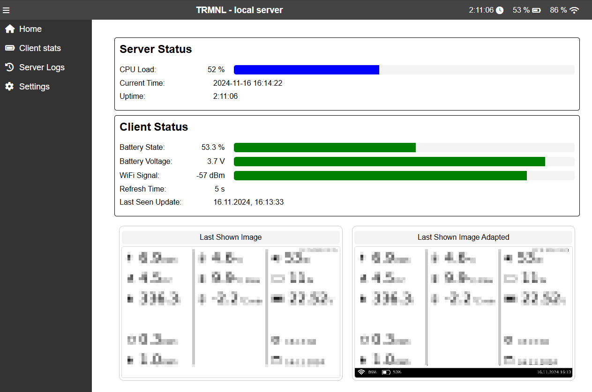
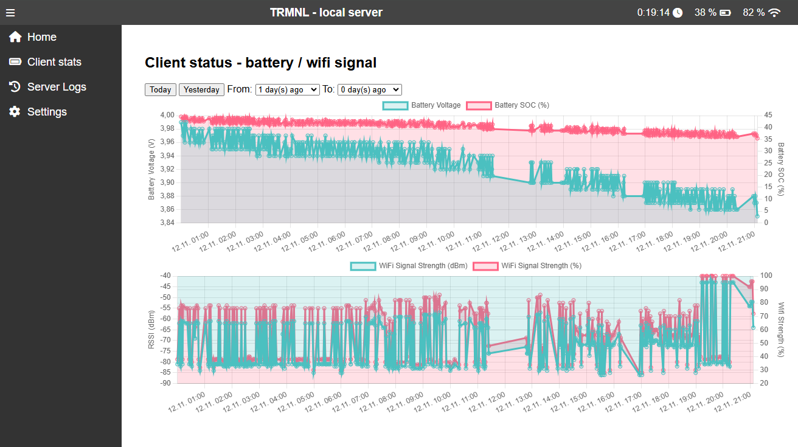
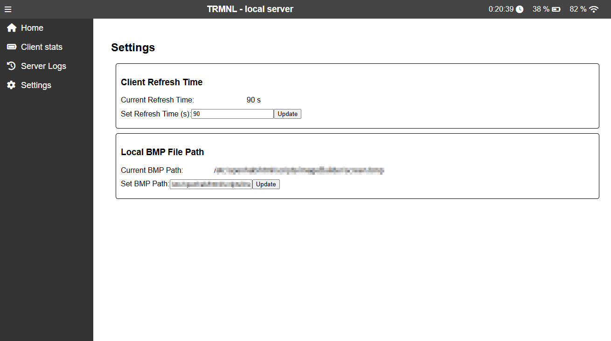

# TRMNL - Local Web Server <!-- omit in toc -->

## TOC <!-- omit in toc -->
- [Overview](#overview)
- [Features](#features)
- [Endpoints](#endpoints)
  - [Serve BMP Images](#serve-bmp-images)
  - [API for Display](#api-for-display)
  - [Logging](#logging)
  - [Configuration Management](#configuration-management)
  - [Server Logs](#server-logs)
  - [Battery Data](#battery-data)
- [Configuration](#configuration)
- [Installation](#installation)
  - [Running in Home Assistant as an Add-On](#running-in-home-assistant-as-an-add-on)
  - [Manual Installation](#manual-installation)
  - [Installation Using install.sh](#installation-using-installsh)
    - [Running as a System Service](#running-as-a-system-service)


## Overview

'TRMNL Local Web Server' is a local web server designed to serve local content (BMP image) to a [TRMNL client e-ink display](https://www.kickstarter.com/projects/usetrmnl/trmnl-the-e-ink-display-for-your-favorite-apps-and-news?lang=de). It simulates the TRMNL cloud server (https://usetrmnl.app/). The server is built using Flask and supports serving BMP images, logging requests, and updating configuration settings.

To enable the usage of TRMNL with this self hosted server there are 2 options:
1. Firmware post https://github.com/usetrmnl/firmware/issues/61 supports self-hosted servers out of the box.
    - there is a possibilty mentioned for using http and https - due to legacy compatibility https have to used with trmnl_server
3. For older firmware a small change is required in [Firmware of TRMNL](https://github.com/usetrmnl/firmware/blob/e3db8c37990c2333ec90b1be10749f9d37620a18/include/config.h#L49)
    - original: ```#define API_BASE_URL "https://trmnl.app" ```
    - change to: ```#define API_BASE_URL "https://<your_ip>:<configured_port>" ``` (e.g. https://192.178.1.10:83)


## Features

- **Serve BMP Images**: Provides endpoints to serve BMP images.
- **manipulate BMP Images**: provide an adpated new image with the collected data from client (wifi strength, battery state)
- **API for Display**: Endpoint to retrieve display information and update settings.
- **Logging**: Logs requests with timestamps and context.
- **Configuration Management**: Allows updating and retrieving configuration settings via API.
- **Firmware Update**: Placeholder for firmware update functionality.







## Endpoints

### Serve BMP Images

- **GET /image/screen.bmp**
  - Serves the BMP image from the configured path.
  - Logs the request with timestamp and context.

- **GET /image/screen1.bmp**
  - Serves the BMP image from the configured path.
  - Logs the request with timestamp and context.

### API for Display

- **GET /api/display**
  - Retrieves display information including image URL, refresh rate, and firmware update status.
  - Logs the request with headers and URL.
  - Responds with a JSON containing status, image URL, refresh rate, and other settings.

### Logging

- **POST /api/log**
  - Logs the content of the request.
  - Responds with a JSON indicating the log status.

### Configuration Management

- **GET /settings**
  - Retrieves the current configuration settings including image path and refresh time.
  - Responds with a JSON containing the configuration settings.

- **POST /settings/refreshtime**
  - Updates the refresh time in the configuration.
  - Responds with a JSON indicating the success or error status.

- **POST /settings/imagepath**
  - Updates the image path in the configuration.
  - Responds with a JSON indicating the success or error status.

### Server Logs

- **GET /server/log**
  - Retrieves the last 30 lines from the log file.
  - Responds with the logs as plain text.

### Battery Data

- **GET /server/battery**
  - Retrieves battery data from the client database.
  - Supports filtering by date range.
  - Responds with a JSON containing the battery data.

## Configuration

The server uses a `config.yaml` file for configuration. If the file does not exist, it will be created with default values.

- **image_path**: Path to the BMP image to be served.
- **refresh_time**: Refresh time for the display.

## Installation

### Running in Home Assistant as an Add-On

You can find the HA addon here [`https://github.com/ohAnd/ha_addons`](https://github.com/ohAnd/ha_addons)

---

1. **Add the Repository**:
   - Open Home Assistant.
   - Navigate to **Settings** > **Add-ons** > **Add-on Store**.
   - Click on the **⋮ (three dots)** in the top-right corner and select **Repositories**.
   - Add the repository URL:  
     `https://github.com/ohAnd/ha_addons`.
     
    or press the button:

     [](https://my.home-assistant.io/redirect/supervisor_add_addon_repository/?repository_url=https%3A%2F%2Fgithub.com%2Fohand%2Fha_addons)


2. **Install the Add-On**:
   - Search for **TRMNL Server** in the Add-on Store.
   - Click on the add-on and select **Install**.

3. **Configure the Add-On**:
   - After installation, go to the **Configuration** tab of the add-on.
   - Adjust the settings (e.g., image path, refresh time) as needed.

4. **Start the Add-On**:
   - Go to the **Info** tab of the add-on.
   - Click **Start** to launch the TRMNL Server.

5. **Access the Server**:
   - The server will be accessible at `http://<your_home_assistant_ip>:8081`.

6. **Logs and Debugging**:
   - Check the **Log** tab for any issues or to monitor the server's activity.


### Manual Installation
1. **Clone the repository**:
   ```sh
   git clone https://github.com/yourusername/trmnlServer.git
   cd trmnlServer
   ```
2. Install dependencies:

    ```pip install -r requirements.txt```

3. Run the server:
    ```python trmnlServer.py```

### Installation Using install.sh
To install the server as a system service using the provided install.sh script, follow these steps:

1. Clone the repository:
    ```
    git clone https://github.com/yourusername/trmnlServer.git
    cd trmnlServer
    ```
2. Make the script executable:

    ```chmod +x install.sh```

3. Run the script to install the service:

    ``` sudo bash install.sh -doit ```

4. Run the script to uninstall the service:

    ``` sudo bash install.sh -uninstall```

#### Running as a System Service
To run the server as a system service, use the provided install.sh script.

1. Start Service

    ``` service trmnlServer start```

2. Uninstall the Service

    ``` service trmnlServer stop```

2. Get Status of the Service

    ``` service trmnlServer status```

